<pre style="color: #fc03d7;">                       _____           _ _
                      |  __ \         | | |
                      | |__) |__ _  __| | |__   ___
                      |  _  // _` |/ _` | '_ \ / _ \
                      | | \ \ (_| | (_| | | | |  __/

```mermaid
---
    title: Tree
    config:
        flowchart:
            curve: linear
---
    graph LR
    home["📁 C"]
        home e1@--> algorithm["📁 Algorithm"]
            algorithm e2@--> algorithmDoc(README.md)

        home --> basics["📁 basics"]
            basics --> tokens["📄 tokens.md"]
                click tokens "https://github.com/Akhil-Biswas/C/tree/main"
                click tokens "https://github.com/Akhil-Biswas/C/tree/main"

            basics --> variables["📁 variables"]
                variables --> variables1["📄 variables.c"]
                variables--> variables2["📄 README.M"]

            basics --> data_types["📄 data_types.md"]
            basics --> operators["📄 operators.md"]

            basics --> control_statements["📁 control_statements"]
                control_statements --> if["📁 if else"]
                control_statements --> switch["📁 switch"]
                control_statements --> loop["📁 loop"]
                    loop --> loop1["📁 for loop"]
                    loop --> loop2["📁 while loop"]

        home --> homeDoc(["📄 README.md"])
        
    %% === STYLE CLASSES ===
    classDef folder fill:,stroke:#faa405,stroke-width:2px,color:#faa405,font-weight:bold,font-size:20px;
    classDef file fill:,stroke:#909090,stroke-width:1px,color:#fff;
    classDef animation stroke-dasharray: 9,5,stroke-dashoffset: 900,animation: dash 25s linear infinite;
    %% === APPLY CLASSES ===
    class home,algorithm,basics,variables,control_statements,if,switch,loop,loop1,loop2 folder;
    class algorithmDoc,tokens,variables1,variables2,data_types,operators,homeDoc file;
    class e1,e2 animation;
```

                      |_|  \_\__,_|\__,_|_| |_|\___| </pre>

